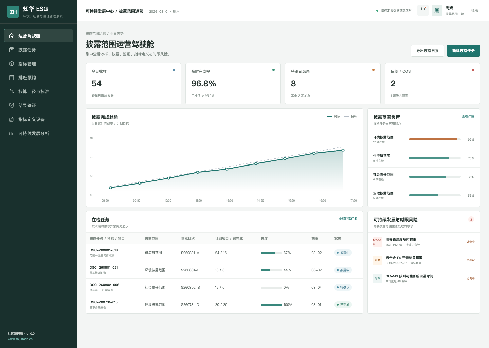
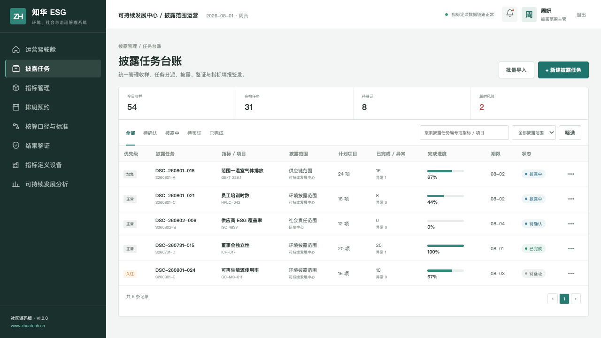
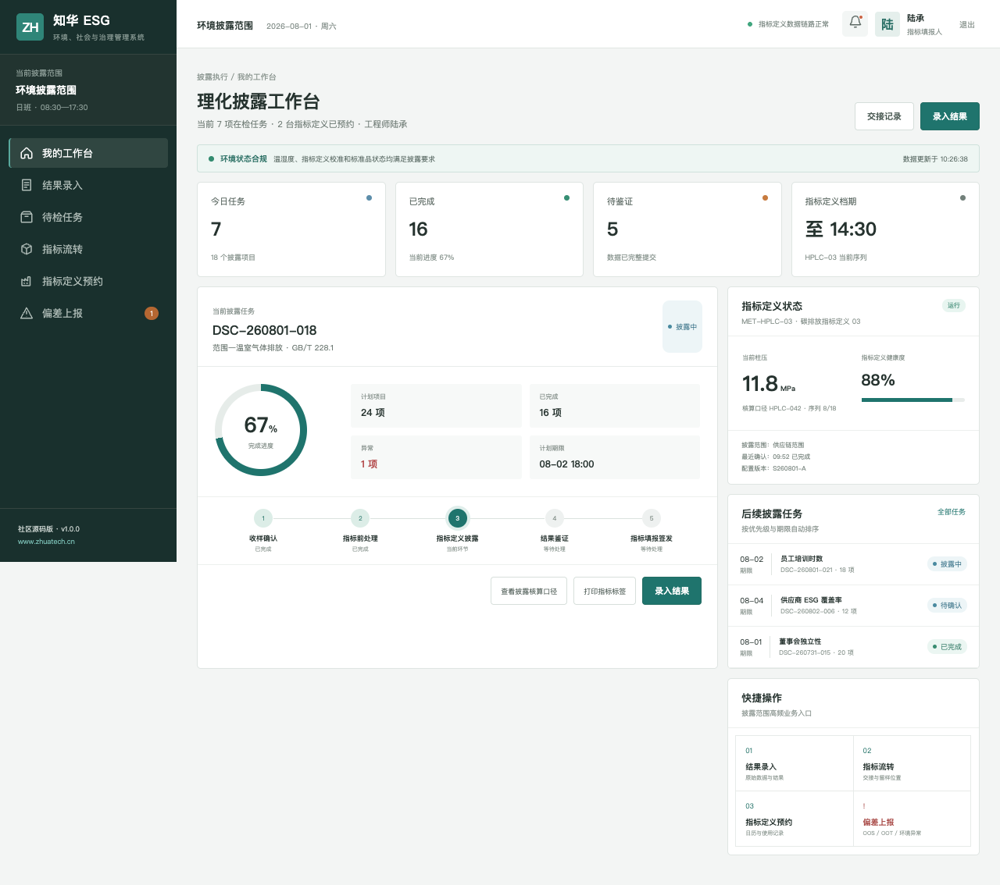

# ZhuaTech ESG｜知华科技可持续发展与披露管理系统

> 统一指标口径、填报责任和鉴证证据，为可持续披露建立可信数据链。

[](backend/pom.xml) [](frontend/package.json) [](compose.yaml) [](LICENSE)

ZhuaTech ESG 是知华科技（上海如静知华信息科技有限公司）维护的可持续发展与披露管理系统社区源码版。项目采用 Java + Vue 前后端分离架构，既提供管理驾驶舱，也提供适配一线岗位的响应式 H5 工作台。企业服务与产品信息见[知华科技官网](https://www.zhuatech.cn/)。

## 业务主线

```text
披露范围 → 指标下发 → 数据填报 → 口径校验 → 鉴证整改 → 报告汇总
```

1. 披露范围、议题库与指标定义
2. 责任分派、周期填报与口径校验
3. 鉴证发现、整改闭环和披露进度

## 真实界面

### ESG 披露运营驾驶舱



### 指标填报与鉴证台账



### 指标责任人工作台



## 工程结构

| 部分 | 技术与职责 |
| --- | --- |
| 后端 | Java 21、Spring Boot、Spring Security、JPA、Flyway |
| 前端 | Vue 3、Pinia、Vue Router、Axios、Vite，响应式管理端与 H5 岗位端 |
| 数据 | MySQL 8；H2 集成测试 |
| 交付 | Docker Compose、Nginx、环境变量配置 |

Java 工程包名为 `cn.zhuatech.esg`，数据库名为 `zhuatech_esg`。角色覆盖指标责任人、ESG 经理、鉴证人员、系统管理员。

## 五分钟运行

仅看演示界面：

```bash
cd frontend
npm install
npm run dev:demo
```

打开 `http://localhost:5173`。管理端账号 `planner / Demo@2026`，岗位端账号 `operator / Demo@2026`。

完整启动：

```bash
cp .env.example .env
# 修改数据库密码与 JWT_SECRET
docker compose up --build
```

## 部署前须知

仓库中的账号、客户、指标、工单和经营数据均为虚构演示数据。正式落地时应更换默认密码与 JWT 密钥，配置 HTTPS、最小权限、数据库备份、操作审计、脱敏策略，并按照所在行业完成安全与合规评估。

## 许可与咨询

本工程仅允许个人、非商业性的学习、研究和技术交流，**不得商用**。企业内部使用、生产部署、SaaS、客户交付、收费培训、咨询实施及品牌替换，均须事先取得上海如静知华信息科技有限公司书面授权。完整条款见 [LICENSE](LICENSE)。

需要深度开发、私有化部署、系统集成或商业授权，请访问[知华科技官网](https://www.zhuatech.cn/)，也可扫码添加微信咨询：

| 微信咨询 1 | 微信咨询 2 |
| --- | --- |
|  |  |

搜索关键词：ESG 源码、可持续发展系统、碳指标管理、ESG 披露、Java ESG、Vue ESG、知华科技、上海如静知华信息科技有限公司。
